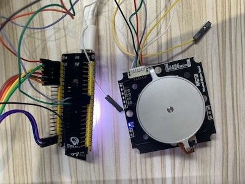

# ESP MT6701 Driver



## Requirement

* esp-idf >= 5.3

## Pin connect

| FROM (ESP32S3) | TO (MT6701) |
|-|-|
| GPIO_35 | MT6701 SDA |
| GPIO_36 | MT6701 SCL |
| 3V3 | VCC |
| GND | GND |

## Example Running log

```
I (27) boot: ESP-IDF v5.3 2nd stage bootloader
I (27) boot: compile time Oct 15 2024 10:05:24
I (27) boot: Multicore bootloader
I (30) boot: chip revision: v0.2
I (34) boot.esp32s3: Boot SPI Speed : 80MHz
I (38) boot.esp32s3: SPI Mode       : DIO
I (43) boot.esp32s3: SPI Flash Size : 16MB
I (48) boot: Enabling RNG early entropy source...
I (53) boot: Partition Table:
I (57) boot: ## Label            Usage          Type ST Offset   Length
I (64) boot:  0 nvs              WiFi data        01 02 00009000 00006000
I (72) boot:  1 phy_init         RF data          01 01 0000f000 00001000
I (79) boot:  2 factory          factory app      00 00 00010000 00100000
I (87) boot: End of partition table
I (91) esp_image: segment 0: paddr=00010020 vaddr=3c020020 size=0b980h ( 47488) map
I (108) esp_image: segment 1: paddr=0001b9a8 vaddr=3fc92900 size=02a44h ( 10820) load
I (110) esp_image: segment 2: paddr=0001e3f4 vaddr=40374000 size=01c24h (  7204) load
I (118) esp_image: segment 3: paddr=00020020 vaddr=42000020 size=1b500h (111872) map
I (145) esp_image: segment 4: paddr=0003b528 vaddr=40375c24 size=0cbd0h ( 52176) load
I (162) boot: Loaded app from partition at offset 0x10000
I (162) boot: Disabling RNG early entropy source...
I (174) cpu_start: Multicore app
I (183) cpu_start: Pro cpu start user code
I (184) cpu_start: cpu freq: 160000000 Hz
I (184) app_init: Application information:
I (186) app_init: Project name:     main
I (191) app_init: App version:      8c33011
I (196) app_init: Compile time:     Oct 15 2024 10:05:16
I (202) app_init: ELF file SHA256:  f9d5987c6...
I (207) app_init: ESP-IDF:          v5.3
I (212) efuse_init: Min chip rev:     v0.0
I (217) efuse_init: Max chip rev:     v0.99 
I (222) efuse_init: Chip rev:         v0.2
I (226) heap_init: Initializing. RAM available for dynamic allocation:
I (234) heap_init: At 3FC95C20 len 00053AF0 (334 KiB): RAM
I (240) heap_init: At 3FCE9710 len 00005724 (21 KiB): RAM
I (246) heap_init: At 3FCF0000 len 00008000 (32 KiB): DRAM
I (252) heap_init: At 600FE100 len 00001EE8 (7 KiB): RTCRAM
I (259) spi_flash: detected chip: generic
I (263) spi_flash: flash io: dio
I (267) sleep: Configure to isolate all GPIO pins in sleep state
I (274) sleep: Enable automatic switching of GPIO sleep configuration
I (281) main_task: Started on CPU0
I (311) main_task: Calling app_main()
I (311) gpio: GPIO[35]| InputEn: 1| OutputEn: 1| OpenDrain: 1| Pullup: 1| Pulldown: 0| Intr:0 
I (311) gpio: GPIO[36]| InputEn: 1| OutputEn: 1| OpenDrain: 1| Pullup: 1| Pulldown: 0| Intr:0 
I (321) main_task: Returned from app_main()
I (321) app_main: GOT ANGLE, int16 = 14790, float = 324.97559
I (531) app_main: GOT ANGLE, int16 = 14790, float = 324.97559
I (731) app_main: GOT ANGLE, int16 = 14790, float = 324.97559
I (931) app_main: GOT ANGLE, int16 = 14790, float = 324.97559
I (1131) app_main: GOT ANGLE, int16 = 14790, float = 324.97559
```
